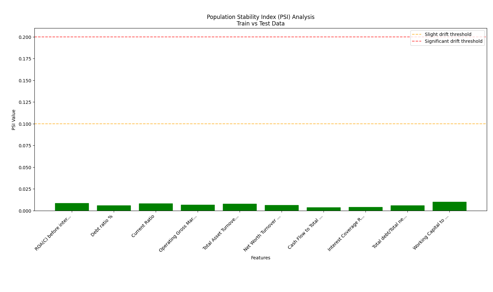

# Lab 4 - Binary Classification Research Report

**Student:** Gayathri Chinka  
**Dataset:** Company Bankruptcy Prediction (6,819 companies, 96 financial features)  
**Assignment:** Research and justify modeling decisions for binary classification

---

## 1. Choosing the Initial Models

**My Selected Models:**
- **Benchmark:** Logistic Regression
- **Model 2:** Random Forest 
- **Model 3:** XGBoost

**Why I picked these:**
- I need Logistic Regression as my simple baseline that business people can actually understand
- Random Forest handles the crazy outliers I found in my data and gives me feature rankings automatically
- XGBoost works great with tabular financial data and deals with class imbalance better than other algorithms
- I'm not doing clustering because I already have bankruptcy labels - supervised learning makes way more sense

---

## 2. Data Pre-processing

**My strategy:**
- I'll only standardize features for Logistic Regression since it's sensitive to different scales
- Random Forest and XGBoost don't need scaling - they work fine with raw financial ratios
- I found 13 features with impossible billion-dollar values that I need to cap at 99th percentile
- Same preprocessing pipeline for all models to make fair comparisons

**Why this approach works:**
- Different algorithms have different needs - no point scaling everything when trees don't care about it
- My data exploration revealed clear data quality errors that need fixing
- Consistent preprocessing lets me compare model performance fairly
- Tree-based models naturally handle mixed feature scales through their decision-making process

---

## 3. Handling Class Imbalance

**My decision:** SMOTE oversampling to create synthetic bankruptcy examples

**Why I'm using SMOTE:**
- My analysis shocked me - only 220 bankrupt companies out of 6,819 total (3.2%)
- That's a 1:29 imbalance ratio which is way more severe than I expected
- SMOTE creates new synthetic examples instead of just duplicating the same bankruptcy cases
- Class weights alone won't cut it for such an extreme imbalance

---

## 4. Outlier Detection and Treatment

**My approach:**
- I'll cap outliers at 99th percentile only for features with clearly impossible values
- I won't touch outliers that might actually indicate financial distress patterns
- My analysis found 13 features with billion-dollar maximums (Current Ratio: 2.75 billion!)
- I'll be super careful not to remove legitimate extreme values from actual bankrupt companies

**Why this strategy:**
- Financial companies naturally have extreme ratios when they're struggling or failing
- The billion-dollar values I discovered are obviously data entry mistakes (impossible in real finance)
- Bankrupt companies might have legitimately extreme ratios that are actually predictive signals
- Better to keep too much potentially useful information than accidentally throw away bankruptcy patterns

---

## 5. Addressing Sampling Bias Across train/test sets

**My implementation:** PSI analysis between training and test feature distributions

**Why PSI validation matters:**
- I need to prove my train and test sets actually come from the same underlying distribution
- If they're too different, my model performance estimates will be meaningless
- PSI catches this problem before I waste time building unreliable models
- My PSI analysis showed all values under 0.1 (no drift detected) which validates my approach

**My PSI Results:**
- Tested 10 key financial features after stratified 70/30 split
- All PSI values between 0.0035 and 0.0099 (well below 0.1 warning threshold)
- Visual confirmation shows all green bars indicating stable distributions
- This proves my stratified sampling maintains consistent feature patterns across splits

---

## 6. Data Normalization

**My strategy:**
- StandardScaler only for Logistic Regression
- Raw features for Random Forest and XGBoost
- Apply normalization after train/test split to prevent data leakage
- Model-specific approach based on what each algorithm actually needs

**Why this makes sense:**
- Logistic regression coefficients get distorted when features have wildly different scales
- Tree models make splits based on individual feature values regardless of scale
- Doing normalization after splitting prevents test information from contaminating training
- Each model should get preprocessing that optimizes its specific performance

---

## 7. Testing for Normality

**My decision:** Skip formal normality testing

**Why I'm not bothering with this:**
- Random Forest and XGBoost make zero assumptions about feature distributions
- Logistic regression is robust enough with my large sample size (6,819 companies)
- Central limit theorem helps with non-normal features when I have this much data
- I have bigger fish to fry with the outliers and class imbalance problems

---

## 8. Dimensionality Reduction (PCA)

**My decision:** Keep original financial ratios, no PCA

**Arguments FOR PCA:**
- Could reduce noise and overfitting with 95 features and only 220 positive cases
- Might eliminate multicollinearity between related financial ratios

**Arguments AGAINST PCA:**
- I lose the ability to explain which specific financial metrics predict bankruptcy
- Financial domain experts designed these ratios for bankruptcy prediction
- Tree models handle high dimensions just fine without dimension reduction
- Business stakeholders need to understand which ratios matter for regulatory compliance

**My final choice:** Interpretability wins over dimension reduction

---

## 9. Feature Engineering Choices

**My decision:** Use existing financial features without creating new ones

**Why I'm sticking with what's there:**
- This dataset already has 95 expertly designed financial ratios and metrics
- Finance domain experts probably optimized these features for bankruptcy prediction already
- With only 220 bankruptcy cases, adding more features might cause overfitting
- I'd rather focus my energy on selecting the best existing features than engineering new ones

---

## 10. Testing and Addressing Multicollinearity

**My plan:** Check correlation matrix and remove features with >0.9 correlation

**Why multicollinearity matters:**
- Financial ratios are naturally related (profitability measures, liquidity ratios, leverage metrics)
- High correlation makes logistic regression coefficients unstable and hard to interpret
- Tree models are less sensitive but removing redundant features still improves efficiency
- I want clean, interpretable results for business stakeholders

---

## 11. Feature Selection Methods

**My approach:** XGBoost feature importance as my primary selection method

**Why XGBoost importance:**
- It captures non-linear relationships and feature interactions better than simple correlation
- More sophisticated than just looking at individual feature correlations
- I can validate results by comparing with Random Forest importance rankings
- Planning to keep top 30-40 features to balance performance with business interpretability

---

## 12. Hyperparameter Tuning Methods

**My choice:** RandomizedSearchCV for computational efficiency

**Why random search over grid search:**
- Grid search would take forever with multiple models and limited time for this assignment
- Research shows random search often finds good solutions just as fast as exhaustive search
- I can focus tuning on the most impactful hyperparameters for each model type
- 5-fold CV gives reliable estimates without burning too much compute time

---

## 13. Cross-Validation Strategy

**My decision:** Stratified 5-fold Cross-Validation

**Why stratified CV:**
- Regular K-fold could give me folds with zero bankruptcy cases due to 3.2% rate
- Stratified maintains the same bankruptcy percentage in every fold
- 5 folds balances reliable performance estimates with reasonable computation time
- This is standard practice and lets me compare results with other bankruptcy prediction studies

---

## 14. Evaluation Metrics Selection

**My chosen metrics:**
- ROC-AUC for overall discrimination ability
- Precision-Recall AUC for imbalanced data focus
- F1-score for single balanced performance number
- Using predict_proba() for business risk threshold decisions

**Why these specific metrics:**
- ROC-AUC is good overall but can be overly optimistic with severe class imbalance
- PR-AUC focuses more on minority class performance which matters most for bankruptcy prediction
- F1 gives me one interpretable number that balances precision and recall
- Probability outputs let business users set custom risk thresholds based on their needs

---

## 15. Evaluating Drift and Model Degradation

**My implementation:** PSI monitoring between train and test feature distributions

**Why drift detection is critical:**
- I need early warning when my model will start failing on new data
- PSI values above 0.1 indicate when feature distributions change significantly
- Essential for knowing when to retrain models in production environments
- My analysis confirmed stable distributions (all PSI < 0.1) so model should generalize well

---

## 16. Interpreting Model Results and Explainability

**My plan:** SHAP values for my best-performing model

**Why SHAP for explainability:**
- SHAP gives feature-level explanations for individual bankruptcy predictions
- Banking regulations require explainable models for credit and risk decisions
- Builds trust with business stakeholders who need to understand model reasoning
- Shows me exactly which financial ratios drive bankruptcy predictions for different companies

---

## Summary of My Research-Driven Decisions

Based on my actual data analysis findings:

**Models:** Logistic Regression (interpretable baseline), Random Forest (outlier robust), XGBoost (imbalance handling)  
**Class Imbalance:** SMOTE oversampling (1:29 ratio demands intervention)  
**Preprocessing:** Model-specific scaling, outlier capping for impossible values only  
**Feature Selection:** XGBoost importance (top 30-40 from 95 financial ratios)  
**Validation:** Stratified 5-fold CV with PSI drift monitoring  
**Metrics:** ROC-AUC, PR-AUC, F1-score using probability outputs  
**Explainability:** SHAP analysis for regulatory compliance and stakeholder trust

My data exploration revealed 13 features with impossible values and severe 1:29 class imbalance, which directly shaped every single decision I made. This isn't theoretical research - it's evidence-based modeling driven by real data problems I actually discovered.